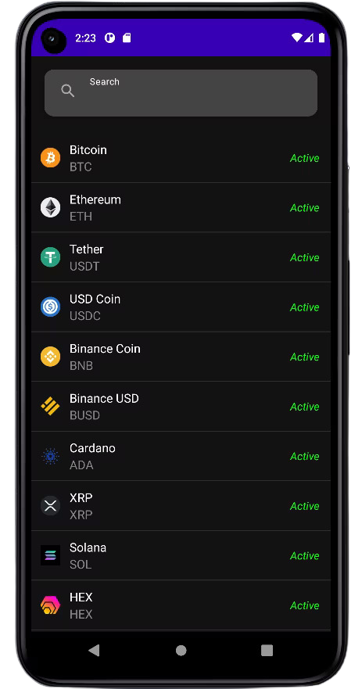
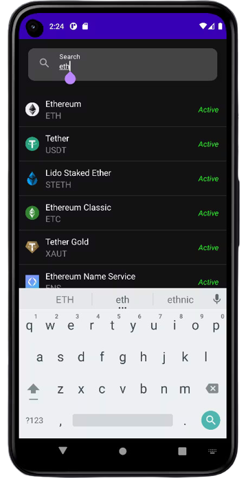
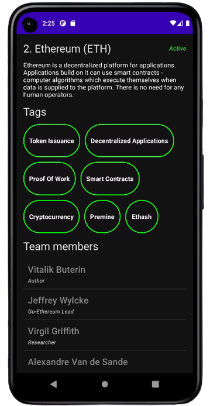

<h1>About</h1>
CoinSearch is an Android App that helps you search for different crypto coins and their information. CoinSearch can help you find familiarity with varying crypto coins in the market.

 

The libraries i use are: 
- [Hilt](https://dagger.dev/hilt/)
- [Retrofit](https://square.github.io/retrofit/)
- [Coil](https://coil-kt.github.io/coil/getting_started/)
